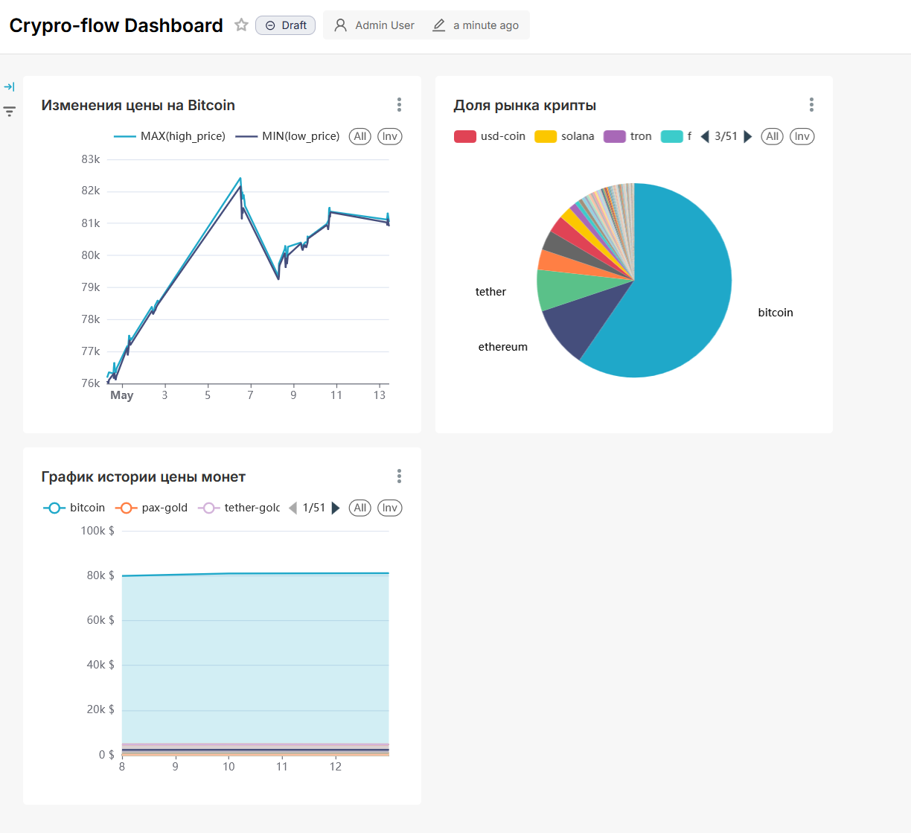

# Crypto Datalake

Пайплайн для сбора и обработки криптовалютных данных в реальном времени на основе архитектуры Data Lakehouse.


## Стек

| Слой | Технологии |
|------|-----------|
| Ingestion | Kafka, Python-продьюсеры (Bybit WebSocket, CoinGecko API) |
| Хранилище | MinIO (S3-совместимое), Apache Iceberg |
| Обработка | Apache Spark (Structured Streaming + batch) |
| Оркестрация | Apache Airflow 3.x |
| Аналитическая БД | ClickHouse |
| Визуализация | Apache Superset |
| Инфраструктура | Docker Compose |

## Архитектура

- Для сбора данных используются 2 контейнера-**продьюсера**: *websocket* и *webapi-poller*. В текущей конфигурации для ws стоит poll только на Bitcoin, но данных летит и так много. Эти продьюсеры кладут данные в *Kafka*.
- Из *Kafka* сырые данные идут в директорию с **Bronze** в s3-bucket через Spark Streaming. Вся полезная нагрузка хранится в нераскодированном виде в поле raw_json сообщения, также в сообщение добавляется служебная информация во время перекладки. Чекпоинты чтения с Kafka храняться в отдельном бакете *spark-checkpoints*.
- Есть "hot path" для данных в ClickHouse, он представлен таблицей с движком Kafka. У этого пути небольшой TTL, предназначается для оперативного получения информации.
- Из Bronze (raw/staging) данные через Spark Streaming обрабатываются в отпаршеный человекочитаемый вид. Результат сохраняется в **Silver** (core-layer) соответствующего бакета. Чекпоинты сохраняются аналогично Bronze.
- Раз в день данные за текущий день (с возможностью *backfill*, для этого предусмотрены *jinja-шаблоны* в запросах) из **Silver** добавляются в **Clickhouse**.
- В BI **Superset** можно создать дашборды на таблицы из *Clickhouse*.



```
Bybit WS / CoinGecko API
        │
      Kafka
        │
   Spark Streaming
        │
   Bronze (Iceberg / MinIO)  ← сырые события
        │
   Spark Streaming
        │
   Silver (Iceberg / MinIO)  ← очищенные данные
        │
   Airflow DAGs
        │
   Gold (ClickHouse)         ← агрегаты для аналитики
        │
   Superset Dashboards
```

**Bronze** (Staging) — сырые события из Kafka, записанные в Iceberg как есть.  
**Silver** (Core) — очищенные и обогащённые данные, по-прежнему на MinIO/Iceberg.  
**Gold** (Marts) — агрегаты, загруженные в ClickHouse для быстрых OLAP-запросов.

## Запуск локально

```bash
docker compose up -d
```

Сервисы доступны по адресам:

| Сервис | URL |
|--------|-----|
| Airflow | http://localhost:8080 |
| Superset | http://localhost:8088 |
| Jupyter | http://localhost:8888 |
| MinIO | http://localhost:9001 |
| Spark Master UI | http://localhost:9090 |
| ClickHouse | localhost:8123 |

## Структура проекта

```
producers/
  bybit_ws_producer.py          # Стримит тикеры с Bybit через WebSocket → Kafka topic "tickers"
  coingecko_polling_producer.py # Поллит цены с CoinGecko API → Kafka topic "prices"
  utils/kafka_client.py         # Обёртка над kafka продьюсером

spark/
  jobs/
    bronze_iceberg.py           # Перекладка сырых данных из Kafka в Iceberg-таблицу в S3
    silver_iceberg_prices.py    # Стриминг из raw в core: парсинг JSON, приведение типов, дедупликация цен
    silver_iceberg_tickers.py   # Стриминг из raw в core: парсинг Bybit payload, дедупликация тикеров
    utils/
      bronze_iceberg_stream.py  # Общая логика чтения Kafka и записи в Iceberg raw
      spark_iceberg_session.py  # Коннектор под Iceberg для подключения к бакету iceberg-lakehouse
      spark_session.py          # Legacy-коннектор для подключения к бакету с Data Lake и работой напрямую с S3

airflow/
  dags/
    gold_prices.py              # DAG: заливает dim_coin + fact_prices в ClickHouse из Silver
    gold_tickers.py             # DAG: заливает fact_tickers (OHLCV по минутам) в ClickHouse из Silver
    aggregation_dag.py          # DAG: запускает Spark job для агрегации данных по core-таблицам. Не работает
  include/
    coin_universe.py            # Список отслеживаемых монет (coin_ids конфиг)
    sql/
      create_*.sql              # DDL таблиц ClickHouse (dim_coin, fact_prices, fact_tickers)
      insert_into_*.sql         # INSERT-запросы из Iceberg S3 → ClickHouse через именованные коллекции
      backup_gold.sql           # Инкрементальный бэкап БД crypto_gold → MinIO (некорректно работает)

clickhouse/
  init/                         # SQL-скрипты инициализации схемы при первом старте контейнера
  queries/                      # Аналитические запросы (изменение цен, OHLCV по тикерам, не настроены под Lakehouse)
  config.d/                     # Конфигурация: listen-адреса, named collections для MinIO/Iceberg

infra/
  init-kafka.sh                 # Создаёт Kafka топики при старте
  init-minio.sh                 # Создаёт бакеты и политики в MinIO
  init-postgres.sh              # Инициализирует БД для Airflow и Superset

notebooks/
  migrations/                   # Разовые миграции (создание Bronze/Silver Iceberg таблиц, см. DEPLOYMENT.md)
  *.ipynb                       # Эксперименты с Bronze/Silver слоями
```
